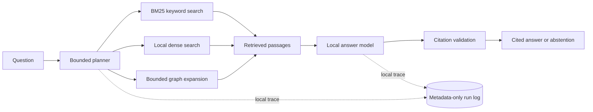

# Agentic GraphRAG

An experimental system for answering multi-hop research questions with keyword, dense, and graph retrieval. It adds a bounded planner that selects retrieval tools, generates cited answers, and can abstain when evidence is insufficient. The project measures whether those added components help over a BM25 baseline; current domain results say they do not.

## Problem and current result

Facts needed for a multi-hop answer can be spread across several papers. This project tests whether linking papers, methods, datasets, and metrics in a knowledge graph improves evidence retrieval enough to justify the extra system complexity. The frozen MuSiQue slice provides a public benchmark; a separate LLM-evaluation research set provides a provisional domain diagnostic.

On the public 300-question benchmark, BM25+dense reciprocal-rank fusion reached supporting-document recall@5 of 0.493 (95% bootstrap CI 0.464–0.522), versus 0.429 for BM25. On the provisional 98-question domain set, graph-only recall@5 was 0.041 and BM25+graph was 0.435, both below BM25 at 0.549. These are retrieval measurements, not answer-quality claims. The graph has not passed manual audits, and the domain corpus still needs relevance and rights review.

See the [hop-split results report](eval/results-summary.md) for the saved retrieval and answer runs, confidence intervals, latency, and model API cost. The project follows the staged [implementation plan](docs/implementation-plan.md); limitations and open milestones are tracked there.

## Architecture



The planner and answer model run through local Ollama; embeddings run locally with Sentence Transformers. No hosted LLM API is required. The graph and domain passages are local generated artifacts and are not committed to the repository. Retrieval evaluation and saved reports use versioned files under `eval/`.

## Current stage

Phase 0 setup is complete. The public 300-question MuSiQue slice and 109-question domain set are frozen. The provisional metadata inventory contains 325 papers and 10,878 page-aware passages, including the 57 frozen QA evidence-source papers; full-text relevance and rights review remains pending. Phase 2 has BM25, local dense, and BM25+dense RRF retrieval results on MuSiQue. In a stratified 30-question local domain answer sample, Qwen3 8B scored exact match 0.000 and token F1 0.287. On the 11 unanswerable domain probes, it abstained end-to-end on 7 (63.6%), including two fail-closed malformed outputs; four unsupported answers remain. Phase 3's expanded local Qwen3 pilot processed 197 passages from 20 papers: 1,734 entity mentions and 636 accepted triples, with 726 rejected by validation. Consolidation produced 994 nodes and 581 edges. Phase 4's domain diagnostic found graph-only recall@5 of 0.041 and BM25+graph RRF recall@5 of 0.435, below BM25's 0.549. The graph is still unaudited and is not ready for production retrieval. Core LLM inference uses local Ollama and has no model API fees; local hardware, electricity, and one-time model downloads still have costs.

## Quick start

Requires Python 3.11 or newer.

```powershell
python -m pip install -e .
python -m agentic_graphrag.pipeline --input data/smoke --output data/processed/smoke.json
```

Configuration lives in `configs/default.toml`. Run from the repository root. The smoke documents are synthetic fixtures for pipeline wiring, not evaluation data.

## Reproduce the public retrieval evaluation

Requires Python 3.11 or newer. The BM25 baseline has no model download; the dense/hybrid run downloads the pinned embedding model on first use.

```powershell
python eval/run_hybrid_eval.py --bm25-only --output data/processed/reproduced_public_bm25.json
python eval/run_hybrid_eval.py --output data/processed/reproduced_public_hybrid.json
python eval/build_results_report.py
```

The first command runs keyword retrieval; the second compares BM25, dense, and BM25+dense RRF over the same frozen MuSiQue slice. To regenerate a summary from the checked-in results without running retrieval or loading a model, run only the final command. Domain graph and agent runs require the local corpus, graph, embedding cache, Ollama models, and additional setup documented in [evaluation](eval/README.md), [graph construction](graph/README.md), and the [local API guide](api/README.md).

## Local model setup

Install and start [Ollama](https://ollama.com/), then download the Apache 2.0 Qwen3 models once:

```powershell
ollama pull qwen3:4b-instruct
ollama pull qwen3:8b
python graph/extract_domain_graph.py --max-passages-per-paper 1
```

Extraction and planning use Qwen3 4B; answer generation uses Qwen3 8B. Both run through the loopback Ollama server, which disables hidden thinking for schema-constrained requests so output tokens remain available for structured responses. The sentence-transformer embedding model also runs locally and downloads its weights on first use. No hosted LLM key is required. See `graph/README.md` for extraction results and `eval/README.md` for the answer-model comparison.

## Project layout

The folders follow the implementation plan: `ingest/`, `extract/`, `graph/`, `retrieval/`, `agent/`, `eval/`, `api/`, `ui/`, `configs/`, and `docs/`. Python code currently lives in `src/agentic_graphrag/` so it can be packaged and imported consistently.

## Evaluation status

Retrieval-only public benchmark results and local answer runs are reported in `eval/README.md`; answer quality remains weak. The public MuSiQue questions and candidate passage corpus are versioned in `eval/data/public/`; the domain evaluation set is frozen in `eval/data/domain/questions_v1.0.jsonl`. The 325-paper inventory remains provisional until full-text relevance and rights review is complete. The expanded local graph pilot, consolidation, candidate generation, audit worksheet preparation, graph retrieval diagnostic, bounded answer and abstention evaluations, a three-question agent pilot, local FastAPI scaffold, and same-origin static UI have been implemented; manual labels, an actual Neo4j load, broader agent evaluation, answer quality work, API/UI runtime verification, Docker packaging, and public deployment remain incomplete.

## Cost, latency, and limitations

The measured Ollama runs incur $0 in hosted model API charges. This does not make local use costless: model downloads, storage, electricity, and capable hardware are still required. On the 30-question stratified domain answer sample, Qwen3 8B averaged 17.4 seconds per question; the three-question agent pilot averaged 77.4 seconds and did not improve F1 over the BM25 answerer. The answerer scored token F1 0.287 with exact match 0.000 on the domain sample, and the unanswerable probe still produced four unsupported answers out of eleven. Treat these as small-sample diagnostics, not production-quality evidence.

The domain paper inventory is provisional, graph extraction and entity resolution are unaudited, faithfulness has no human-calibrated judge, and broad fixed-hybrid/agent comparisons remain open. The API is local-only: it requires loopback Ollama, has no authentication or TLS, and is not ready for public deployment. See the [implementation plan](docs/implementation-plan.md) for outstanding human audits, failure analysis, runtime verification, and packaging work.
